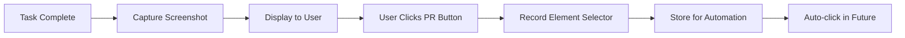

# Product Requirements Document (PRD)
## Conductor - Claude Code Orchestration Suite

**Version:** 1.0.0
**Date:** November 2024
**Status:** Draft
**Owner:** karolswdev

---

## 1. Executive Summary

Conductor is a sophisticated Terminal User Interface (TUI) application that orchestrates automated task execution through Claude Code. It provides batch processing capabilities for AI-assisted development tasks while maintaining human oversight through an elegant, modern terminal interface.

### Key Value Propositions
- **Automation at Scale**: Process multiple development tasks sequentially with intelligent scheduling
- **Human-in-the-Loop**: Maintain control over authentication and critical decisions
- **Beautiful UX**: Premium terminal experience that makes automation enjoyable
- **Resilient Execution**: Smart retry logic with exponential backoff and jitter
- **Session Management**: Peek into browser sessions and manage PR creation

## 2. Problem Statement

### Current Pain Points
1. **Manual Repetition**: Developers must manually input tasks one-by-one into Claude Code
2. **No Batch Processing**: Cannot queue multiple tasks for sequential execution
3. **Session Management**: Difficult to track multiple Claude Code sessions
4. **Rate Limiting**: No intelligent handling of API/service limits
5. **Context Switching**: Constant switching between terminal and browser

### Target Users
- **Primary**: Software engineers using Claude Code for development tasks
- **Secondary**: DevOps engineers automating code reviews and documentation
- **Tertiary**: Technical leads managing team development workflows

## 3. Product Goals & Success Metrics

### Goals
1. **Efficiency**: Reduce time spent on repetitive Claude Code interactions by 80%
2. **Reliability**: Achieve 95%+ task completion rate with retry mechanisms
3. **User Satisfaction**: Create a TUI so beautiful users prefer it over GUI alternatives
4. **Scalability**: Support processing of 100+ tasks in a single session

### Success Metrics
| Metric | Target | Measurement Method |
|--------|--------|-------------------|
| Task Success Rate | >95% | Completed tasks / Total tasks |
| Average Retry Count | <2 | Total retries / Total tasks |
| User Session Length | >30 min | Time from start to voluntary exit |
| Daily Active Users | >100 (3 months) | Unique users per day |
| PR Creation Rate | >90% | PRs created / Tasks completed |

## 4. Functional Requirements

### 4.1 Task Definition System

#### YAML Schema
```yaml
tasks:
  - id: "TASK-001"  # Unique identifier for internal tracking
    name: "Add Tests"  # Short name for TUI display (max 20 chars)
    prompt: "Create comprehensive unit tests for the authentication module"
    expected_deliverable: "test_auth.py with >90% coverage"
    priority: high  # high, medium, low
    auto_pr_timeout: 1800  # seconds before auto-creating PR (30 min default)
    pr_strategy: "aggressive"  # aggressive (30m), normal (60m), patient (120m), manual
    retry_policy:
      max_attempts: 3
      backoff_factor: 2
    dependencies: []  # List of task IDs that must complete first
    repository: "karolswdev/my-project"  # Optional, defaults to config
```

#### Requirements
- **FR-001**: System SHALL support YAML file loading with schema validation
- **FR-002**: System SHALL support multiple tasks per YAML file
- **FR-003**: System SHALL validate task IDs are unique within a session
- **FR-004**: System SHALL support task dependencies and ordering

### 4.2 Authentication & Initialization

#### Requirements
- **FR-005**: System SHALL launch browser for manual authentication
- **FR-006**: System SHALL detect successful Claude Code login
- **FR-007**: System SHALL provide countdown timer for auth timeout
- **FR-008**: System SHALL support session persistence for re-authentication

### 4.3 TUI Interface

#### Layout Components
```
┌─ Conductor v1.0.0 ─────────────────────────────── [Theme: Cyberpunk] ─┐
│┌─ Task Queue ──────┬─ Current Execution ─────┬─ Metrics ────────────┐│
││ ▶ TASK-001 [Add.. ]│ Task: TASK-001         │ Success: 42/45      ││
││ ▷ TASK-002 [Doc.. ]│ Status: Running        │ Failed: 3           ││
││ ▷ TASK-003 [Ref.. ]│ Progress: ████░░ 67%   │ Avg Time: 3m 24s    ││
││ ○ TASK-004 [Test. ]│ Elapsed: 02:15         │ Total Time: 2h 31m  ││
││                    │ Retries: 0/3           │ Rate Limit: OK      ││
│└────────────────────┴────────────────────────┴─────────────────────┘│
│┌─ Browser Preview ─────────────────────────────────────────────────┐│
││ 🌐 claude.ai/code/session_011CV3PaU84XPmkgM5ssTJm3                ││
││ Branch: claude/task-001-add-tests-011CV3PaU84                     ││
││ [ASCII art preview of current browser state]                       ││
││                                                                     ││
││ Actions: [P]eek  [C]reate PR  [S]kip  [R]etry  [A]bort           ││
│└────────────────────────────────────────────────────────────────────┘│
│ [1-9] Select Task  [↑↓] Navigate  [Enter] Details  [Q] Quit  [?] Help │
└─────────────────────────────────────────────────────────────────────┘
```

#### Requirements
- **FR-009**: System SHALL display real-time task queue with status indicators
- **FR-010**: System SHALL show current execution progress with visual bar
- **FR-011**: System SHALL provide metrics dashboard with success/failure rates
- **FR-012**: System SHALL show ASCII preview of browser state
- **FR-013**: System SHALL support keyboard navigation and shortcuts
- **FR-014**: System SHALL support multiple color themes

### 4.4 Browser Control & MCP Integration

#### Requirements
- **FR-015**: System SHALL connect to Playwright MCP server
- **FR-016**: System SHALL maintain browser session across tasks
- **FR-017**: System SHALL detect and handle browser disconnections
- **FR-018**: System SHALL support element discovery through HITL

### 4.5 Session Peeking & Tab Management

#### Requirements
- **FR-019**: System SHALL capture browser screenshots on demand for ANY active session
- **FR-020**: System SHALL convert screenshots to ASCII art for TUI display
- **FR-021**: System SHALL show current Claude Code session URL
- **FR-022**: System SHALL display current git branch name
- **FR-031**: System SHALL support multiple browser tabs for parallel workstreams
- **FR-032**: System SHALL allow switching between tabs with keyboard shortcuts
- **FR-033**: System SHALL maintain rolling log file of ALL branch names created
- **FR-034**: System SHALL timestamp and persist branch information across sessions
- **FR-035**: System SHALL support peeking at ANY browser tab at ANY time

### 4.6 PR Creation Automation

#### HITL Element Discovery Flow


#### Requirements
- **FR-023**: System SHALL support manual PR button discovery
- **FR-024**: System SHALL store element selectors for reuse
- **FR-025**: System SHALL auto-detect PR readiness
- **FR-026**: System SHALL wait for PR creation confirmation

### 4.7 Retry & Backoff Logic

#### Algorithm
```python
delay = min(initial_delay * (backoff_factor ** attempt), max_delay)
jittered_delay = delay * (1 + random.uniform(-jitter, jitter))
```

#### Requirements
- **FR-027**: System SHALL implement exponential backoff
- **FR-028**: System SHALL add configurable jitter
- **FR-029**: System SHALL respect rate limit responses
- **FR-030**: System SHALL track retry attempts per task

## 5. Non-Functional Requirements

### 5.1 Performance
- **NFR-001**: TUI SHALL refresh at minimum 10 FPS
- **NFR-002**: System SHALL handle 1000+ tasks in queue
- **NFR-003**: Memory usage SHALL not exceed 500MB

### 5.2 Reliability
- **NFR-004**: System SHALL persist state across crashes
- **NFR-005**: System SHALL support graceful shutdown
- **NFR-006**: System SHALL log all operations for debugging

### 5.3 Usability
- **NFR-007**: System SHALL provide onboarding tutorial
- **NFR-008**: System SHALL include comprehensive help system
- **NFR-009**: System SHALL support accessibility features

### 5.4 Security
- **NFR-010**: System SHALL NOT store authentication credentials
- **NFR-011**: System SHALL use secure MCP connections
- **NFR-012**: System SHALL sanitize all user inputs

## 6. Technical Architecture

### 6.1 Technology Stack
| Component | Technology | Justification |
|-----------|------------|---------------|
| Language | Python 3.11+ | Async support, rich ecosystem |
| TUI Framework | Textual 0.47+ | Modern, reactive, beautiful |
| Styling | Rich 13.0+ | Terminal formatting excellence |
| MCP Client | mcp-python-sdk | Official SDK support |
| Config | YAML/TOML | Human-readable, standard |
| State Store | SQLite | Embedded, reliable |
| Testing | pytest + pytest-asyncio | Industry standard |

### 6.2 Project Structure
```
conductor/
├── src/
│   ├── conductor/
│   │   ├── __init__.py
│   │   ├── main.py           # Entry point
│   │   ├── tui/              # TUI components
│   │   ├── mcp/              # MCP integration
│   │   ├── tasks/            # Task management
│   │   ├── browser/          # Browser control
│   │   ├── utils/            # Utilities
│   │   └── themes/           # Theme definitions
│   └── tests/
├── config/
│   ├── default.yaml
│   └── themes/
├── docs/
├── examples/
│   └── tasks.yaml
└── pyproject.toml
```

## 7. User Flows

### 7.1 First-Time Setup
1. User installs Conductor via pip
2. User runs `conductor init`
3. Configuration wizard launches
4. User configures MCP server connection
5. User selects default theme
6. System creates config file

### 7.2 Task Execution Flow
1. User creates tasks.yaml file
2. User runs `conductor run tasks.yaml`
3. TUI launches with splash screen
4. Browser opens for authentication
5. User logs into Claude Code
6. User confirms ready in TUI
7. System begins task processing
8. User monitors progress in TUI
9. System creates PRs automatically
10. User reviews completion summary

### 7.3 HITL PR Discovery
1. Task completes successfully
2. System prompts for PR creation
3. User manually clicks PR button
4. System captures element selector
5. System stores selector for future use
6. Next task auto-clicks PR button

## 8. Development Phases

### Phase 1: Foundation (Week 1-2)
- Core TUI layout
- YAML task loading
- Basic MCP integration

### Phase 2: Orchestration (Week 3-4)
- Task queue management
- Retry logic implementation
- Browser control

### Phase 3: Intelligence (Week 5-6)
- HITL element discovery
- PR automation
- Session peeking

### Phase 4: Polish (Week 7-8)
- Theme system
- Performance optimization
- Documentation

## 9. Risk Analysis

| Risk | Probability | Impact | Mitigation |
|------|------------|--------|------------|
| MCP API changes | Medium | High | Version pinning, abstraction layer |
| Browser automation detection | Low | High | Human-like delays, jitter |
| Rate limiting | High | Medium | Exponential backoff, monitoring |
| TUI performance issues | Low | Low | Profiling, optimization |

## 10. Open Questions

1. Should we support multiple browser sessions in parallel?
2. How do we handle tasks that require human interaction mid-execution?
3. Should we integrate with CI/CD systems in future versions?
4. What's the optimal default backoff strategy?
5. Should we support custom MCP servers beyond Playwright?

## 11. Success Criteria

The project will be considered successful when:
1. ✅ Users can process 50+ tasks automatically
2. ✅ TUI receives positive feedback for aesthetics
3. ✅ 95%+ task success rate achieved
4. ✅ PR creation automated successfully
5. ✅ Documentation enables self-service adoption

---

**Document History**
| Version | Date | Author | Changes |
|---------|------|--------|---------|
| 1.0.0 | 2024-11-11 | Karol Świderski | Initial PRD creation |