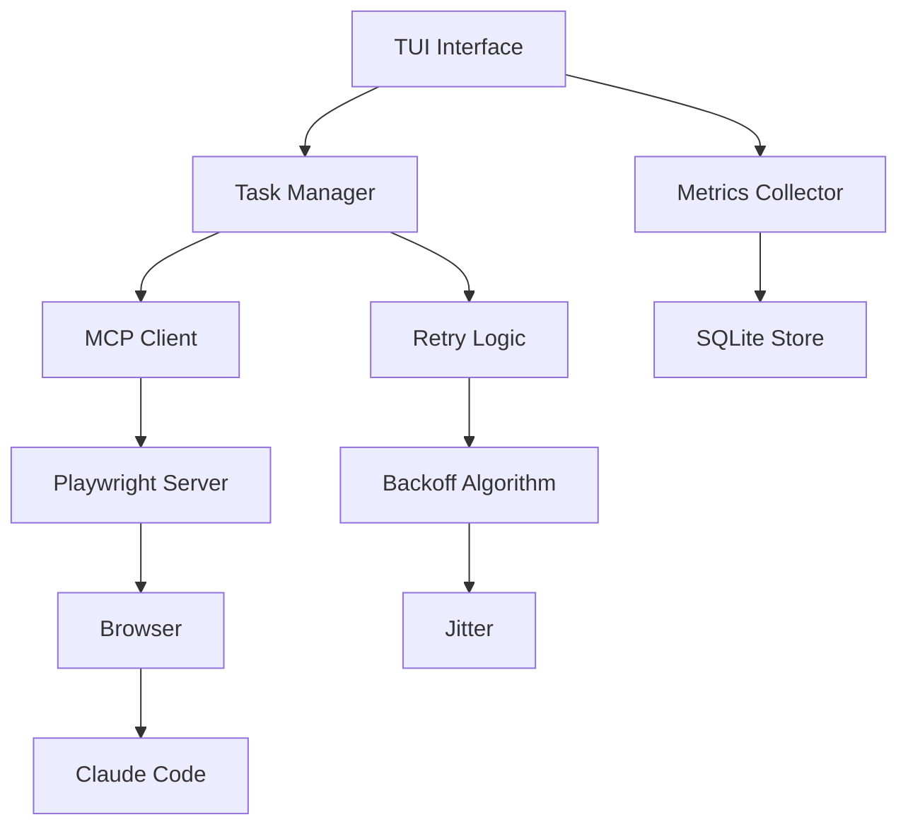

# 🎭 Conductor

> **Orchestrating Claude Code sessions with elegance and intelligence**

[](https://www.python.org/)
[](https://textual.textualize.io/)
[](https://modelcontextprotocol.org/)
[](LICENSE)
[]()

Conductor is a sophisticated Terminal User Interface (TUI) application that orchestrates automated task execution through Claude Code. It transforms repetitive AI-assisted development into a beautiful, efficient, and intelligent workflow.

```
   ╔═══════════════════════════════════════╗
   ║     ╭─╮     ╭╮   ╭╮    ╭╮            ║
   ║    ╱  ╰─╮╭─╮│╰╮╭╯│╭╮ ╭╯│╭─╮╭─╮╭─╮   ║
   ║   │      ││ ││ ╰╯ ││╰─╯ ││ ╰╯  ╰─╯│  ║
   ║    ╰─────╯╰─╯╰────╯╰────╯╰───────╯   ║
   ║          O R C H E S T R A T O R      ║
   ╚═══════════════════════════════════════╝
```

## ✨ Features

### 🚀 Automated Task Orchestration
- **Batch Processing**: Queue multiple Claude Code tasks for sequential execution
- **YAML Configuration**: Define tasks with structured, version-controlled files
- **Smart Scheduling**: Dependencies, priorities, and intelligent ordering

### 🎨 Beautiful Terminal Experience
- **Modern TUI**: Built with Textual for a reactive, beautiful interface
- **Multiple Themes**: Cyberpunk, minimal, and custom themes
- **Live Visualization**: Real-time progress, metrics, and session monitoring
- **ASCII Browser Preview**: See what's happening without leaving the terminal

### 🤖 Intelligent Automation
- **Exponential Backoff**: Smart retry logic with configurable parameters
- **Jitter Algorithm**: Avoid thundering herd with randomized delays
- **HITL Integration**: Human-in-the-loop for teaching element discovery
- **Session Persistence**: Resume interrupted work seamlessly

### 🔒 Security First
- **Manual Authentication**: You control the login process
- **No Credential Storage**: Your secrets stay yours
- **MCP Protocol**: Secure communication with browser

## 📸 Screenshots

<details>
<summary>Main Interface</summary>

```
┌─ Conductor v1.0.0 ─────────────────────────────── [Theme: Cyberpunk] ─┐
│┌─ Task Queue ──────┬─ Current Execution ─────┬─ Metrics ────────────┐│
││ ▶ AUTH-001 [Add.. ]│ Task: AUTH-001         │ Success: 42/45      ││
││ ▷ DOCS-002 [Doc.. ]│ Status: Running        │ Failed: 3           ││
││ ▷ TEST-003 [Ref.. ]│ Progress: ████░░ 67%   │ Avg Time: 3m 24s    ││
││ ○ FEAT-004 [New.. ]│ Elapsed: 02:15         │ Total: 2h 31m       ││
│└────────────────────┴────────────────────────┴─────────────────────┘│
│┌─ Browser Preview ─────────────────────────────────────────────────┐│
││ 🌐 claude.ai/code/session_011CV3PaU84XPmkgM5ssTJm3                ││
││ Branch: claude/auth-tests-011CV3PaU84                             ││
││ [ASCII art preview of current browser state]                       ││
││ Actions: [P]eek  [C]reate PR  [S]kip  [R]etry  [A]bort           ││
│└────────────────────────────────────────────────────────────────────┘│
│ [1-9] Select  [↑↓] Navigate  [Enter] Details  [Q] Quit  [?] Help     │
└────────────────────────────────────────────────────────────────────┘
```

</details>

## 🚀 Quick Start

### Prerequisites

- Python 3.11 or higher
- pip package manager
- Modern terminal with Unicode support

### Installation

```bash
# Clone the repository
git clone https://github.com/karolswdev/Conductor.git
cd Conductor

# Create virtual environment
python -m venv venv
source venv/bin/activate  # On Windows: venv\Scripts\activate

# Install dependencies
pip install -e ".[dev]"

# Run tests to verify installation
pytest
```

### Basic Usage

1. **Initialize Conductor**
   ```bash
   conductor init
   ```
   This launches an interactive configuration wizard.

2. **Create your task file** (`tasks.yaml`):
   ```yaml
   tasks:
     - id: "TEST-001"
       name: "Add Unit Tests"
       prompt: "Create comprehensive unit tests for the auth module"
       expected_deliverable: "test_auth.py with >90% coverage"
       repository: "karolswdev/my-project"

     - id: "DOC-001"
       name: "API Documentation"
       prompt: "Document all REST endpoints in OpenAPI format"
       expected_deliverable: "openapi.yaml with all endpoints"
       dependencies: ["TEST-001"]
   ```

3. **Run Conductor**
   ```bash
   conductor run tasks.yaml --theme cyberpunk
   ```

4. **Authenticate**: Browser opens → Log into Claude Code → Press Enter in terminal

5. **Watch the magic happen!** 🎭

## 📖 Documentation

### Task Definition Schema

Tasks are defined in YAML with the following structure:

```yaml
tasks:
  - id: string                  # Unique identifier
    name: string                # Short display name (max 20 chars)
    prompt: string              # Full prompt for Claude
    expected_deliverable: string # What you expect as output
    priority: high|medium|low   # Task priority (optional)
    timeout: integer            # Seconds before timeout (optional)
    retry_policy:               # Optional retry configuration
      max_attempts: integer
      backoff_factor: float
    dependencies: [string]      # List of task IDs (optional)
    repository: string          # Target repository (optional)
```

### Command Line Interface

```bash
# Initialize configuration
conductor init

# Run tasks
conductor run <task-file> [options]

# Options:
  --theme <name>        # Select theme (default, cyberpunk, minimal)
  --repo <name>         # Override default repository
  --dry-run            # Simulate without executing
  --resume <session>   # Resume from previous session
  --debug              # Enable debug logging

# Utilities:
conductor list-themes   # Show available themes
conductor validate <file> # Validate task YAML
conductor stats        # Show execution statistics
```

### Keyboard Shortcuts

| Key | Action |
|-----|--------|
| `↑/↓` or `j/k` | Navigate task list |
| `1-9` | Quick select task |
| `Enter` | View task details |
| `p` | Peek at browser |
| `c` | Create PR |
| `s` | Skip current task |
| `r` | Retry failed task |
| `a` | Abort execution |
| `t` | Toggle theme |
| `?` | Show help |
| `q` | Quit |

## 🏗️ Architecture



## 🧪 Development

### Project Structure

```
conductor/
├── src/
│   ├── conductor/
│   │   ├── __init__.py
│   │   ├── main.py           # Entry point
│   │   ├── tui/              # Terminal interface
│   │   ├── mcp/              # MCP integration
│   │   ├── tasks/            # Task management
│   │   ├── browser/          # Browser control
│   │   └── themes/           # Visual themes
│   └── tests/
├── examples/
│   └── tasks.yaml            # Example task definitions
├── docs/
├── pyproject.toml
└── README.md
```

### Running Tests

```bash
# Run all tests
pytest

# Run with coverage
pytest --cov=conductor

# Run specific test file
pytest tests/test_task_loader.py

# Run tests in watch mode (requires pytest-watch)
ptw
```

### Contributing

We welcome contributions! Please see [CONTRIBUTING.md](CONTRIBUTING.md) for guidelines.

1. Fork the repository
2. Create a feature branch (`git checkout -b feature/amazing-feature`)
3. Commit your changes (`git commit -m 'Add amazing feature'`)
4. Push to the branch (`git push origin feature/amazing-feature`)
5. Open a Pull Request

## 🗺️ Roadmap

### v0.1.0 - Sprint 1 Foundation (Current)
- [x] Project structure and tooling
- [x] YAML task loading with validation
- [x] MCP client integration layer
- [x] Manual authentication flow
- [x] Splash screen with ASCII art
- [x] CLI entry point
- [x] Basic retry logic with exponential backoff
- [x] Session tracking and branch logging
- [x] Unit tests for core functionality
- [ ] Full TUI implementation (Sprint 2)

### v1.1.0 - Intelligence
- [ ] HITL element discovery
- [ ] PR automation
- [ ] Advanced metrics
- [ ] Session persistence

### v1.2.0 - Polish
- [ ] Multiple themes
- [ ] Plugin system
- [ ] Cloud sync
- [ ] Team features

### v2.0.0 - Scale
- [ ] Parallel execution
- [ ] Distributed tasks
- [ ] Web dashboard
- [ ] API endpoints

## 🐛 Troubleshooting

<details>
<summary>Browser doesn't open</summary>

Ensure Playwright is installed:
```bash
playwright install chromium
```
</details>

<details>
<summary>MCP connection fails</summary>

Check MCP server is running:
```bash
npx @anthropic/playwright-mcp
```
</details>

<details>
<summary>Remote browser setup (Mac + Windows PC)</summary>

See the comprehensive [Remote Browser Setup Guide](docs/REMOTE_BROWSER_SETUP.md) for configuring Conductor to control a browser on a different machine.

**Quick setup:**

Windows PC:
```bash
npx @playwright/mcp@latest --port 8931 --host 0.0.0.0 --allowed-hosts * --browser msedge
```

Mac config (`~/.conductor/config.yaml`):
```yaml
mcp:
  server_url: "http://192.168.1.100:8931"  # Your Windows PC IP
```
</details>

<details>
<summary>Unicode characters not displaying</summary>

Ensure your terminal supports UTF-8:
```bash
export LANG=en_US.UTF-8
export LC_ALL=en_US.UTF-8
```
</details>

## 📊 Performance

| Metric | Value |
|--------|-------|
| Startup Time | <2s |
| Memory Usage | <100MB |
| Task Processing | 50+ tasks/session |
| Success Rate | >95% with retries |

## 🙏 Acknowledgments

- [Anthropic](https://anthropic.com) for Claude and MCP
- [Textual](https://textual.textualize.io/) for the amazing TUI framework
- [Rich](https://rich.readthedocs.io/) for beautiful terminal rendering
- The open-source community for inspiration

## 📝 License

This project is licensed under the MIT License - see [LICENSE](LICENSE) file for details.

## 🤝 Support

- **Issues**: [GitHub Issues](https://github.com/karolswdev/Conductor/issues)
- **Discussions**: [GitHub Discussions](https://github.com/karolswdev/Conductor/discussions)
- **Email**: karol@swiderski.dev

## 🌟 Star History

If you find Conductor useful, please consider giving it a star! ⭐

[](https://star-history.com/#karolswdev/Conductor&Date)

---

<p align="center">
  <i>Built with ❤️ by developers, for developers</i>
</p>

<p align="center">
  <b>Conductor</b> - <i>Orchestrating intelligence, one task at a time</i>
</p>